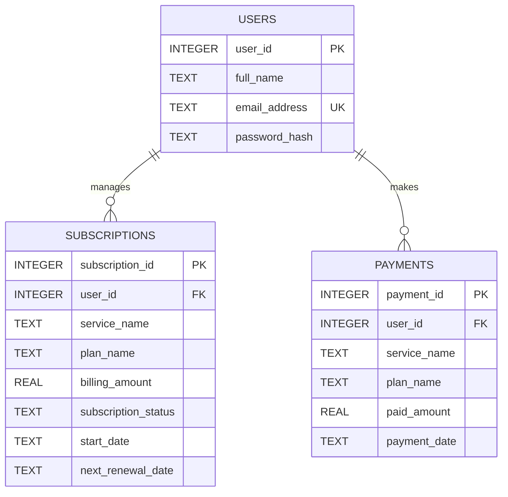

# SUB-TRACK: Subscription & Billing Manager

A lightweight, premium full-stack subscription tracking application designed to help users manage, monitor, and optimize their monthly recurring payments (such as Netflix, Spotify, Amazon Prime, etc.). 

This project was built from scratch to demonstrate full-stack development capability, database design, secure token-based authentication, and dynamic user interface flows.

---

## 🚀 Key Features

* **Glassmorphic UI with Light/Dark Mode**: A beautiful, harmonized UI theme that toggles dynamically and persists the selected choice across pages using `localStorage`.
* **Interactive Authentication tabs**: Standard tab switching (Login / Sign Up) built natively on the main auth page to facilitate quick access.
* **Smart Subscription Dashboard**: Add, update, view, and cancel subscriptions. Displays calculated base amounts, tax (18% GST), and total costs dynamically.
* **Invoice Download Engine**: Generates and downloads professional PDF receipts itemizing transaction histories and GST tax breakdowns.
* **Authentication Security**: Implements secure signups and logins using **Bcrypt** password hashing and **JSON Web Token (JWT)** session states.

---

## 🗄️ Database Design & Normalization

The backend utilizes **SQLite** for structured data persistence. To show strong design methodologies, the database has been built using a clean, normalized relational structure:

### Entity Relationship Diagram (ERD)



### Table Schemas & Attributes

#### 1. `users` Table
Stores authentication details for users.
- `user_id` (INTEGER, Primary Key, Auto-Increment): Unique identifier.
- `full_name` (TEXT, Not Null): User's legal name.
- `email_address` (TEXT, Unique, Indexed): User's email address used as username login.
- `password_hash` (TEXT, Not Null): Hashed representation of password (via `bcryptjs`).

#### 2. `subscriptions` Table
Stores details of active or cancelled user subscriptions.
- `subscription_id` (INTEGER, Primary Key, Auto-Increment): Unique subscription record ID.
- `user_id` (INTEGER, Foreign Key referencing `users(user_id)`): Associated owner of subscription.
- `service_name` (TEXT, Not Null): Identifier of the service (e.g., `'netflix'`, `'spotify'`).
- `plan_name` (TEXT, Not Null): Specific plan level (e.g., `'premium'`, `'super'`).
- `billing_amount` (REAL, Not Null): Base monthly billing rate.
- `subscription_status` (TEXT, Default `'active'`): Current status (`'active'` or `'cancelled'`).
- `start_date` (TEXT, Not Null): ISO timestamp when subscription was bought.
- `next_renewal_date` (TEXT, Not Null): ISO timestamp of the upcoming renewal invoice.

#### 3. `payments` Table (Invoices)
Logs transactional billing histories.
- `payment_id` (INTEGER, Primary Key, Auto-Increment): Unique invoice identifier.
- `user_id` (INTEGER, Foreign Key referencing `users(user_id)`): Customer reference.
- `service_name` (TEXT, Not Null): Name of service.
- `plan_name` (TEXT, Not Null): Plan name.
- `paid_amount` (REAL, Not Null): Grand total charged.
- `payment_date` (TEXT, Not Null): ISO timestamp of transaction.

### Normalization Levels Met

* **First Normal Form (1NF)**: All columns contain atomic values, and each record has a unique primary key identifier. No repeating groups or multi-value attributes exist.
* **Second Normal Form (2NF)**: Meets 1NF. Because all tables use single-column surrogate keys (`user_id`, `subscription_id`, `payment_id`), there are no partial functional dependencies. Every non-key column is fully dependent on the primary key.
* **Third Normal Form (3NF)**: Meets 2NF. There are no transitive functional dependencies (where a non-key column depends on another non-key column). 
  *Design Note*: In an enterprise app, available services and plans would reside in separate static tables. Because plan rules and pricing are statically configured in frontend logic (`services-config.js`), placing service/plan descriptors on the active subscription row represents the most efficient state layout while maintaining functional constraints.

---

## 🛠️ Technology Stack

* **Frontend**: HTML5, CSS3, Vanilla JS, Font-Awesome Icons
* **Backend**: Node.js, Express.js
* **Database**: SQLite3 (relational engine)
* **Auth**: JSON Web Tokens (`jsonwebtoken`), Bcrypt password encryption (`bcryptjs`)
* **Templating & PDF**: EJS templates, PhantomJS-based PDF compiler (`html-pdf`)

---

## ⚡ How to Run Locally

### Prerequisites
Make sure you have [Node.js](https://nodejs.org) installed on your system.

### Steps

1. Navigate to the inner project directory:
   ```bash
   cd SUBTRACK-main/SUBTRACK-main
   ```

2. Go to the `backend` folder and install packages:
   ```bash
   cd backend
   npm install
   ```

3. Start the Express backend server:
   ```bash
   npm start
   ```

4. Open your browser and navigate to:
   `http://localhost:5000`

---

## 🔒 Security Practices Demonstrated
- **Password Protection**: Passwords are never stored in raw text. They are hashed using a 10-round salt hash via `bcrypt` during registration.
- **Stateless Session Management**: Login issues a cryptographically signed JSON Web Token (JWT). API routes require validation of this token via custom middleware (`verifyToken`).
- **Endpoint Route Isolation**: Static frontend assets are hosted via `/`, while all functional database access occurs on separated API pathways under `/api/*`.

